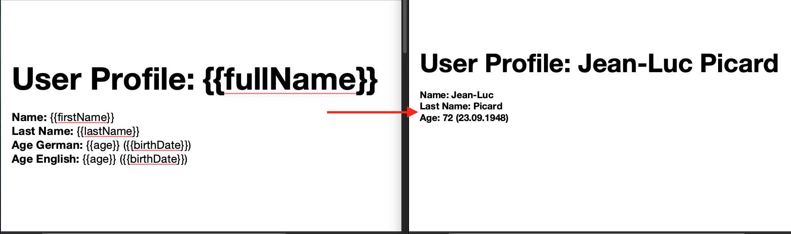

# jocument
> JVM based template engine for office document formats (for now DOCX and XLSX).

 

With jocument you can easily provide custom configurable office templates for your software. The template language uses the familiar curly-brace syntax for placing data into documents (e.g. `Name: {{firstName}} {{lastName}}`), provides mechanics for loops and custom placeholders as well as supporting a variety of different data source types (JSON, POJOs, ...) - you can even easily build your own.



## Installation

We're hosting jocument releases on the repositories [GitHub Packages Page](https://github.com/DDS-GmbH/jocument/packages/383705/versions):

```xml
<dependency>
  <groupId>com.docutools</groupId>
  <artifactId>jocument</artifactId>
</dependency>
```

## Usage Example

```java
@Test
@DisplayName("Generate a document from a simple template.")
void shouldGenerateSimpleDocument() throws InterruptedException, IOException {
  // Arrange
  // (1)
  Template template = Template.fromClassPath("/templates/word/UserProfileTemplate.docx")
      .orElseThrow();
  // (2)
  PlaceholderResolver resolver = new ReflectionResolver(SampleModelData.PICARD_PERSON);

  // Act
  // (3)
  Document document = template.startGeneration(resolver);
  // (4)
  document.blockUntilCompletion(60000L); // 1 minute

  // Assert
  assertThat(document.completed(), is(true));

  Desktop.getDesktop().open(document.getPath().toFile());
}
```

1. Loads a template from the classpath. The `Template` class provides multiple static methods to load templates from various sources (file system, network, memory).
2. A `PlaceholderResolver` is the data source a `Template` uses to resolve the values for the placeholders placed in the underlying template. Here we choose the `ReflectionResolver` implementation, which takes a Java POJO as source and resolves the template placeholder against its property names.
3. A `Template` generates instances of `Document`s, which persist the filled out template to a file on the local FS. `Document`s are generated asynchronously by default (using the [ForkJoinPool#commonPool()](https://docs.oracle.com/javase/8/docs/api/java/util/concurrent/ForkJoinPool.html#commonPool--)).
4. We block until the `Document` generation completes.

## Development Setup

The library is developed with JDK 14. You can read further on development and contribution guidelines in [CONTRIBUTE.md](CONTRIBUTE.md).

## META

jocument is developed by the employees of [DDS GmbH Austria](https://www.docu-tools.com/en/disclaimer/), the company behind the digital construction documentation software [docu tools](https://www.docu-tools.com/en/disclaimer/).
