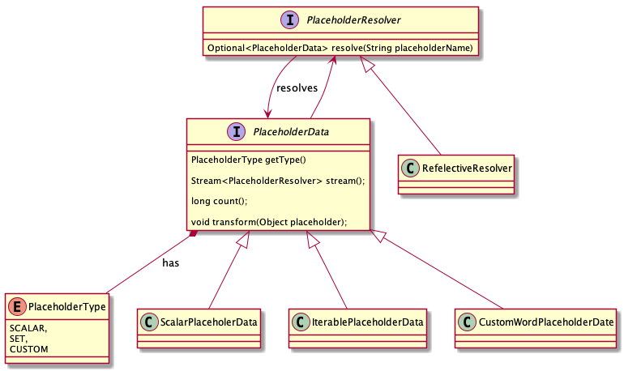

JVM based template enginer for DOCX and XLSX.

## Concept


*Component diagram.*

### Template

A template is defined by a MIME-Type and template file.

The **MIME-Type** (e.g. `DOCX`) defines the format of the reports that can be based on
this template.

The **template file** is a file/document/spreadsheet that represents the actual template
with its placeholders, structure and format. A template of MIME-Type `DOCX` requires a
`.docx` template file.

A template can be loaded from the classpath as shown here:

```java
var template = Template.fromClassPath("templates/MyTemplate.docx");
```

1. It's easy to load templates from various sources (classpath, filesystem, network, ...).
2. After loading the template file and MIME Type it gets immediately validated.
3. The template instance provides an interface to start report generations asynchronously
and synchronously.

### Report


Shows the Reports implementation by the example of word / DOCX reports. The `Template`
returns upon start a `Report` instance. In this case a `WordReportImpl`. Which in turn
calls the `WordGenerator` with the passed placeholder which uses `WordUtilities` for 
the generation.

### Placeholders



The placeholder model is extensible: You have a set of standard resolvers (e.g. the
Java Reflection based resolver `ReflectiveResolver`) and a set of standard 
`PlaceholderData` implementations (e.g. `SinglePlaceholderData`).

A `PlaceholderData` of type `LIST` resolves to a `Stream<PlaceholderResolvers>` and can be
used for lists, e.g.:

```
{{people}}
Name: {{firstName}} {{lastName}}
Age: {{age}}
{{/people}}
```

 A `PlaceholderData` of type `SINGLE` can just evaluated to a String by calling `.toString()`.
 
 A `PlaceholderData` of type `CUSTOM` takes the Placeholder object of a `Report` (e.g. a
 `XWPFParagraph`) and transforms it to the desired content.
 
 #### Example: Generate a Simple Word Report
 
 The Word / `.docx` Template (we assume it's stored as classpath resource under `templates/1.docx`):
 
 
 
 The corresponding class:
 
 ```java
package myapp;

class Captain {
  String name;
  FirstOfficer officer;
  List<Service> services;
}

class FirstOfficer {
  String name;
  int rank;
  Uniform uniform; // Uniform is an Enum
} 

class Service {
  String shipName;
}
```

Generating the Report:

```java
package myapp;

class TestCase {
  
  void shouldGenerateReport(Captain captain) {
    var template = Template.fromClasspath(getClass().getResource("/templates/1.doxc"))
      .orElseThrow();
    var resolver = new ReflectiveResolver(captain);
    
    Report report = template.start(resolver);
    report.blockUntilCompletion(60000L);

    assert report.isComplete() == true;
    assert report.getPath() != null;
  }

}
```
